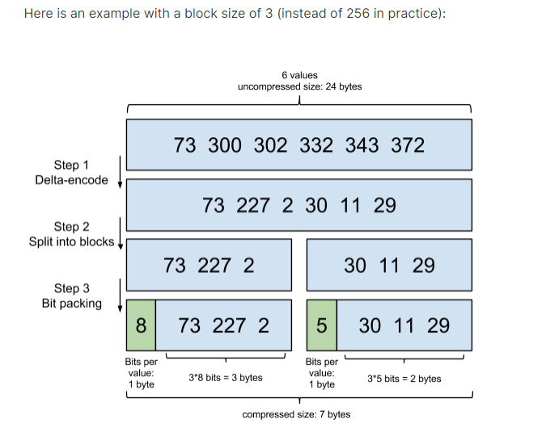

# 倒排序
从一个具体例子开始：  

|docid | 年龄| 性别
| --------   | -----:   | :----: |
|1|18|女
|2|20|女
|3|18|男

这里每一行是一个document。每个document都有一个docid。那么给这些document建立的倒排索引就是：

|年龄 | 文档集合|
| --------   | -----:   |
|18|[1,3]
|20| [2]

|性别|文档集合
| --------   | -----:   |
|女| [1,2]
|男| [3]
可以看到，倒排索引是per field的，一个字段由一个自己的倒排索引。
18,20这些叫做 **term**，而[1,3]就是**posting list**。Posting list就是一个int的数组，存储了所有符合某个term的文档id。
那么什么是term dictionary 和 term index？

假设我们有很多个term，比如：

**Carla,Sara,Elin,Ada,Patty,Kate,Selena**

如果按照这样的顺序排列，找出某个特定的term一定很慢，因为term没有排序，需要全部过滤一遍才能找出特定的term。排序之后就变成了：

**Ada,Carla,Elin,Kate,Patty,Sara,Selena**

这样我们可以用二分查找的方式，比全遍历更快地找出目标的term。这个就是 **term dictionary**。
有了term dictionary之后，可以用 logN 次磁盘查找得到目标。但是磁盘的随机读操作仍然是非常昂贵的（一次random access大概需要10ms的时间）。所以尽量少的读磁盘，有必要把一些数据缓存到内存里。
但是整个term dictionary本身又太大了，无法完整地放到内存里。于是就有了term index。term index有点像一本字典的大的章节表。比如：

A开头的term ……………. Xxx页

C开头的term ……………. Xxx页

E开头的term ……………. Xxx页

如果所有的term都是英文字符的话，可能这个term index就真的是26个英文字符表构成的了。但是实际的情况是，term未必都是英文字符，term可以是任意的byte数组。
而且26个英文字符也未必是每一个字符都有均等的term，比如x字符开头的term可能一个都没有，而s开头的term又特别多。实际的term index是一棵trie 树：
# 字典树
保存 term index
# skip list 跳表
将post list 分块，block
比如：  
[1,3,13,101,105,108,255,256,257]  
我们可以把这个list分成三个block：  
[1,3,13] [101,105,108] [255,256,257]  

然后可以构建出skip list的第二层：
# delta coding 增量编码
增量编码（delta coding）通过维护增量的方式，保存数据，这样能够达到更好的压缩比，
对于保存连续的或者数据段在一个稳定范围内出现的场景，效果更好。
要求数据先从小到大排好序。   
[1,101,255]

# Frame Of Reference编码
使用这种编码对block进行压缩。  
将posting list按照65535为界限分块，比如第一块所包含的文档id范围在0~65535之间，第二块的id范围是65536~131071，以此类推。
块上面再分256个小块，这样每个小块不超255，排序后的id按照增量编码方式存储，每个值不超255 可以用1个字节来表示；
看下官网示例：
step1:对docid先进行增量编码；
step2：分块；
step3：计算块中最大值的占用的max(bits)，然后计算总的bits，最后取整为byte就是压缩后的容量；

[frame-of-reference-and-roaring-bitmaps](https://www.elastic.co/cn/blog/frame-of-reference-and-roaring-bitmaps)
# Bitset 数据结构 （bitmap？）
bit数组，记录的整数对应该数组的下标，对应的值为1，没有对应的就是0，比如：     
[1,3,4,7,10]  
对应的bitset就是：  
[1,0,1,1,0,0,1,0,0,1]
# Roaring Bitmap 数据结构
虽然bitset数据能够极大的压缩数据，1byte 有 8bit，可以代表8个filter，但是doc以十亿级别计算，
得到的bitset还是很大的，放内存就不现实了，Roaring Bitmap既能保证快速的and和or运算，又能很好
地压缩数据量。   

`
For instance, if your postings list is [73, 300, 302, 332, 343, 372], the list of deltas would be [73, 227, 2, 30, 11, 29].
`
