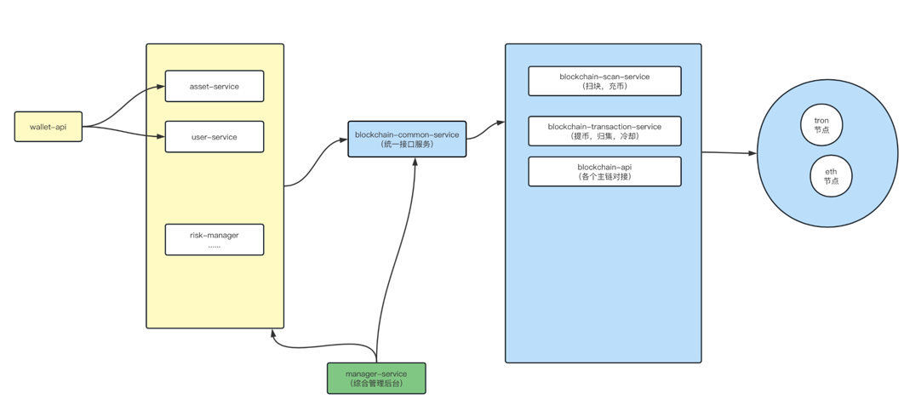

# 数字货币钱包设计
## 1 什么是数字货币钱包
我们日常的钱包一般用来存放现金的，用于日常使用。
数字货币钱包，则是存放数字加密货币资产的工具，可以和区块链网络进行交互，实现
加密货币的流转。目前，常见加密货币钱包分为三类：软件钱包、硬件钱包以及纸钱包。
根据私钥的掌握权，又分为中心化钱包与去中心化钱包。
相对于私钥掌握在第三方服务商手中的中心化钱包（交易所或者一些钱包服务商），
去中心化钱包的私钥则由用户自己保存，资产存储在区块链上，
用户是真正的数字货币的持有者，钱包只是帮助用户管理链上资产和读取区块链数据的一个工具，
所以也就无法控制、窃取、转移你的资产。
本文讨论的是中心化钱包系统。  

## 2 基本术语
* 私钥  
  私钥是由字母和数字组成的64位长度的十六进制字符串，2的256次方。私钥即是一切！私钥即是一切！！私钥即是一切！！！
* 助记词  
  助记词的出现是由于私钥由64位字符串组成，不方便记录且容易抄错。为了方便用户记忆和记录，简化成12个单词组成的助记词。
助记词等价于私钥！助记词等价于私钥！！助记词等价于私钥！！！
* 公钥  
一般是私钥经过椭圆曲线函数计算得出，比特币使用了secp256k1标准所定义的一种特殊的椭圆曲线和一系列数学常数。
* 地址  
公钥经过一系列的转换得到一组字母和数字组成的字符串，如btc的地址使用了两个hash160，tron使用base58编码，
以太坊则是使用单向哈希函数（Keccak-256）从公钥或合约派生的，只保留最后的20个字节（大端序中的最低有效字节），
在加上0x作为前缀，表示16进制，所以以太坊的地址是不区分大小写的。地址是链上公开的，用来接受充币。
从系统的角度，地址还可以细分：**用户地址，热钱包地址，冷钱包地址**。
* 用户地址  
给用户使用的地址，用户可以往自己的地址充币，系统会把该地址收到的资产都记录在用户余额中。
* 热钱包地址  
系统用于归集业务的收款地址，以及提币业务的出款地址。
* 冷钱包地址  
用来存放业务资产的地址，系统没有冷钱包的权限。  

## 3 系统概述
中心化钱包必然会存在的一些服务模块：用户，资产，扫块，充币，提币，归集，冷却，对账，风控，api服务，综合管理后台等。
基本模块如下：  
  

## 4 扫块充币
扫块顾名思义就是扫描链上的每一个block，解析所有的交易transaction，如果有toaddress是系统的地址（包括用户的地址和热钱包地址），
就拿出来执行后续相关币种的上账。
## 5 归集
## 6 提币
## 7 资产

