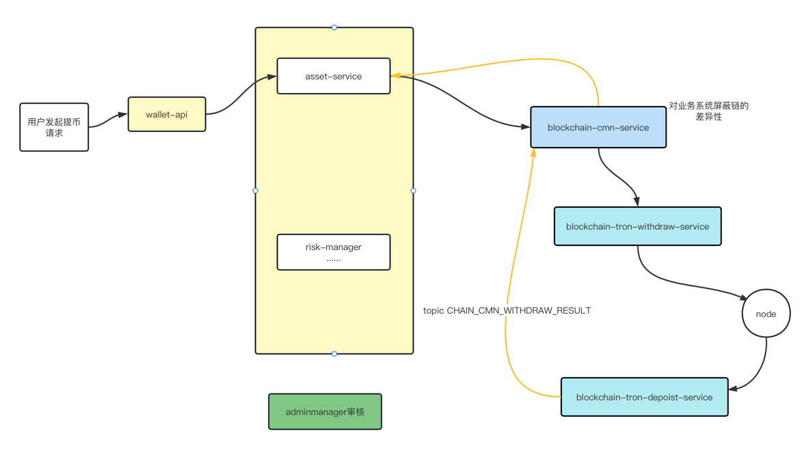

# 数字货币钱包设计
## 1 什么是数字货币钱包
我们日常的钱包一般用来存放现金的，用于日常使用。
数字货币钱包，则是存放数字加密货币资产的工具，可以和区块链网络进行交互，实现
加密货币的流转。目前，常见加密货币钱包分为三类：软件钱包、硬件钱包以及纸钱包。
根据私钥的掌握权，又分为中心化钱包与去中心化钱包。
相对于私钥掌握在第三方服务商手中的中心化钱包（交易所或者一些钱包服务商），
去中心化钱包的私钥则由用户自己保存，资产存储在区块链上，
用户是真正的数字货币的持有者，钱包只是帮助用户管理链上资产和读取区块链数据的一个工具，
所以也就无法控制、窃取、转移你的资产。
本文讨论的是中心化钱包系统。  

## 2 基本术语
* 私钥  
  私钥是由字母和数字组成的64位长度的十六进制字符串，2的256次方。私钥即是一切！私钥即是一切！！私钥即是一切！！！
* 助记词  
  助记词的出现是由于私钥由64位字符串组成，不方便记录且容易抄错。为了方便用户记忆和记录，简化成12个单词组成的助记词。
助记词等价于私钥！助记词等价于私钥！！助记词等价于私钥！！！
* 公钥  
一般是私钥经过椭圆曲线函数计算得出，比特币使用了secp256k1标准所定义的一种特殊的椭圆曲线和一系列数学常数。
* 地址  
公钥经过一系列的转换得到一组字母和数字组成的字符串，如btc的地址使用了两个hash160，tron使用base58编码，
以太坊则是使用单向哈希函数（Keccak-256）从公钥或合约派生的，只保留最后的20个字节（大端序中的最低有效字节），
在加上0x作为前缀，表示16进制，所以以太坊的地址是不区分大小写的。地址是链上公开的，用来接受充币。
从系统的角度，地址还可以细分：**用户地址，热钱包地址，冷钱包地址**。
* 用户地址  
给用户使用的地址，用户可以往自己的地址充币，系统会把该地址收到的资产都记录在用户余额中。
* 热钱包地址  
系统用于归集业务的收款地址，以及提币业务的出款地址。
* 冷钱包地址  
用来存放业务资产的地址，系统没有冷钱包的权限。  

## 3 系统概述
中心化钱包必然会存在的一些服务模块：用户，资产，扫块，充币，提币，归集，冷却，对账，风控，api服务，综合管理后台等。
基本模块如下：  
  
蓝色部分为链服务，对业务服务如资产，管理，风控等提供统一的接口和数据接口，屏蔽链的差异性，
统一接口，各链具体实现；黄色部分则是业务服务。

## 4 扫块充币
### 4.1 顺序扫块 
扫块顾名思义就是扫描链上的每一个block，解析所有的交易transaction，如果有toaddress是系统的地址（包括用户的地址和热钱包地址），
就拿出来执行后续相关币种的上账。每个链单独部署一个扫块服务没必要，需要将共同的功能进一步抽象。
整个扫块的动能可以分解为下载块，解析transaction，校验transaction三个异步动作。这样的好处就是削峰，
比如btc 10分钟才一个块，但是一个块可能有2k-5k的交易，如果是同步执行，资源监控不难发现，10分钟一个波峰的情况。
而且根据之前的经验，处理一个btc块的时间会非常长，这其实是非常不好的一种思路。所以我们的目前的
最佳实践是，充分利用中间件，空间换时间。  
### 4.2 扫特定块高
为了解决顺序异常或者其他原因导致的漏扫块，单独加一个job来手动执行即可。
### 4.3 扫指定交易
跟4.2的功能类似，有时没必要为了一个交易去扫描整个块。
### 4.4 下载块  
单独一个job，不同的链使用不同的线程，轮询查询节点，只下载稳定块，一旦获取新的块，解析transactions，全部丢到MQ。
### 4.5 校验transaction
交易校验，状态是否成功，是否是已支持的token，toaddress是否属于系统，金额必须按照不同的token的进度，计算后入库，
做到所见即所得，**地址余额**表更新，最后还是通过MQ 传递给资产服务。

## 5 归集
归集的对象是用户地址的余额，对于自动归集，一般会有一个阈值的设置，当地址对应的token的余额高于阈值，才触发归集。
手动归集，则根据传入条件筛选符合条件的地址进行归集，该功能放在管理后台。这里不同的链的处理会复杂一点。
比如evm的，就不能是并行处理，所以最好当前有且仅有一个地址的归集单在进行中。还有一种情况是，归集是需要消耗主链币的，
主链币不足，需要能够自动打入主链币，完成这笔归集订单。自动打主链币的功能也适合提币过程中遇到的主链币不足的情况。
## 6 提币
提币整体流程如下：  
  
跟资产和风控密切相关，这里只说链服务相关，提币要找合适的热钱包出款，找出提币金额和手续费都满足的热钱包地址，
生成提币订单withdraw_order，如果矿工费不足，则需要生成打矿工费的订单，同一个地址出款需要保证串行。所以热钱包
会有多个，方便提币业务繁忙时订单的生成。提币签名前一定要校验to地址的有效性，就是要反查资产的提币订单，确保地址无误。

## 7 冷却
冷却就是将热钱包超过阈值的资产转移到冷钱包，系统是没有冷钱包私钥，这个属于公司资产，系统只是简单的管理，
注意，冷钱包的增加功能是没有，每次增加由运营发起，开发提供sql，运维执行，广而告之。
后台只提供简单的浏览功能，冷却阈值设置，自动、手动冷却，删除冷钱包地址。
##  资产
资产负责校验用户余额，冻结，解冻等操作，上账一般采用拉链表，记录每次账变，数据落库确保事务的一致性。  
## 链节点
链节点主要分自建节点，付费节点，免费不稳定节点。从业务的稳定性考虑和业务量考虑，倾向自建节点。
而且主网的节点至少2个，分别在不同的机房或者不同的云。付费节点可以作为一个备用服务，免费节点就算了。
另外，测试网节点至少要有1个，毕竟测试一直用真钱也是会肉疼的。日常维护就是跟进各个链的一些升级情况。
升级节点参考各大厂，是否需要停服发公告等。  
## 代码规范
这个参考阿里的那套手册，结合自身实际情况即可。特殊说明一下，日志的记录一定要写在需要记录日志的地方，
别耍啥小聪明搞个代码复用，使用一个本地方法专门记录日志，这样查日志，你就会发现，不同的异常输出地方都在一处。
这不得把接手的同事给气死？
## 日志
目前使用的是kibana。开源好用，没啥说的。
## 定时任务
xxljob
## 消息中间件
rocketMQ，主要是文档全面，大家比较熟悉，也是经过了大厂的锤炼，就目前使用集群部署基本没有出现过大问题。
## 代码分支管理

| 分支          | 描述         |  
|-------------|------------|  
| feature/xxx | 一般功能开发     |  
| hotfix/xxx  | 紧急修复       |  
| dev         | 开发共用调试分支   |  
| sit         | 测试专用调试分支   |  
| uat         | 预发环境专用调试分支 |  
| master      | 生产环境专用调试分支 |  

最佳实践是，uat代码分支与master同步，上uat环境开始，使用稳定版本号，最终验收通过后，直接使用uat分支
作为生产分支，就保证验证代码与生产一致，不好的地方就是需求得排队上uat环境。具体情况具体分析吧，各家有各活。  
